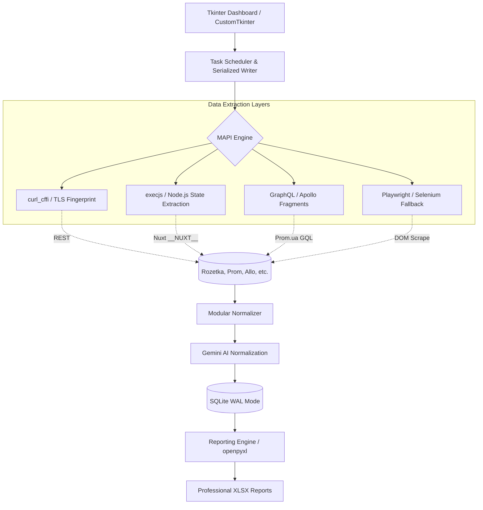

# Marketplace Intelligence Tool

**An industrial-grade competitive intelligence engine that transforms fragmented Ukrainian e-commerce data into actionable business structured insights.**

---

## 💼 Business & Product Context
In the highly competitive Ukrainian e-commerce landscape (dominated by Rozetka, Prom, and Allo), price agility and assortment depth define market share. For B2B sellers, manually tracking thousands of SKUs across multiple platforms is a bottleneck.

This tool solves the **fragmented data problem** by:
- **Consolidating Multi-Channel Data:** Aggregating pricing, availability, and specs from 6+ major marketplaces.
- **Enabling Price Intelligence:** Moving from "guessing" to data-driven pricing through automated snapshots and historical monitoring.
- **Reporting & Audits:** Generating professional, multi-sheet Excel reports with price dynamics, KPI summaries, and automated delta calculations.

---

## 🏗️ Architecture Overview

The system is built on a modular "MAPI" (Marketplace API) engine, designed to handle the heterogeneity of web architectures—ranging from legacy BS4 parsing to modern GraphQL and Nuxt.js SSR applications.

---

## 🛠️ Technical Deep Dive: Why It’s Hard

Building a scraper is easy; building a **resilient scraping pipeline** that survives production anti-bot measures is an engineering challenge.

### 1. The Cat-and-Mouse Game (TLS & Fingerprinting)
Modern marketplaces use sophisticated WAFs (Cloudflare/Akamai) that detect standard Python `requests` or `httpx` via TLS fingerprinting.
- **Solution:** Integrated `curl_cffi` to impersonate browser-level TLS fingerprints (JA3/JA3S). This allows for high-speed HEAD and GET requests without the overhead of a headless browser.

### 2. State Extraction & GraphQL Precision
Many modern targets (like Allo or Prom) either bake their data into internal JS state objects or use GraphQL.
- **Strategy:** Extracted raw `__NUXT__` objects via `execjs` for Allo and implemented a specialized **GraphQL Master Spec** for Prom.ua, ensuring 100% data fidelity compared to fragile HTML scraping.

### 3. SQLite Concurrency & Serialized Writes
Handling thousands of concurrent requests while maintaining a local database requires careful state management.
- **Solution:** Utilized **SQLite in WAL (Write-Ahead Logging) mode** with a dedicated `DbWriteQueue`. All writes are serialized through a single writer thread, eliminating "database is locked" errors during high-concurrency MAPI scrapes.

### 4. Professional Reporting Engine
Converting raw data into business value requires more than a CSV export.
- **Solution:** Built a multi-sheet reporting engine using `openpyxl` that generates comparison reports between snapshots, highlighting "New", "Gone", and "Changed" prices with automated KPI visualizations.

---

## ⚡ Key Technical Decisions

| Feature | Implementation | Rationale |
| :--- | :--- | :--- |
| **Concurrency** | `asyncio` + `TaskScheduler` | High throughput for I/O bound network requests. |
| **Business Layer** | Client -> Task -> Snapshot | Enables project-based management and historical tracking. |
| **Stability** | Absolute Path Enforcement | Centralized data storage (`/data/`) that thrives even after project relocation. |
| **GUI Aesthetics** | `CustomTkinter` Modernization | Replaced legacy widgets with modern, compact controls and custom scrollbars. |
| **Specialized Tools** | GQL Builder & Contact Scraper | Standalone utilities for advanced technical monitoring and lead generation. |

---

## 🚀 Roadmap & Current Status

- [x] **Phase 1: Multi-Engine Scraper:** Completed MAPI architecture for Rozetka, Prom, Allo, and Epicentr.
- [x] **Phase 2: Data Robustness:** Centralized directory structure and absolute path enforcement.
- [x] **Phase 2.1: BI Layer:** Implemented "Client -> Task -> Snapshot" hierarchy for historical persistence.
- [x] **Phase 2.2: Professional Reporting:** Multi-sheet Excel export engine with price dynamics.
- [ ] **Phase 3: Global Intelligence:** Full integration of Gemini-powered structured attribute mapping.
- [ ] **Phase 4: Web Dashboard:** Transitioning from Tkinter to a Next.js / FastAPI web interface.

---

**Built with precision for the Ukrainian e-commerce market.**  
*This is a solo-engineered project focusing on high-load data extraction and product-market fit.*

