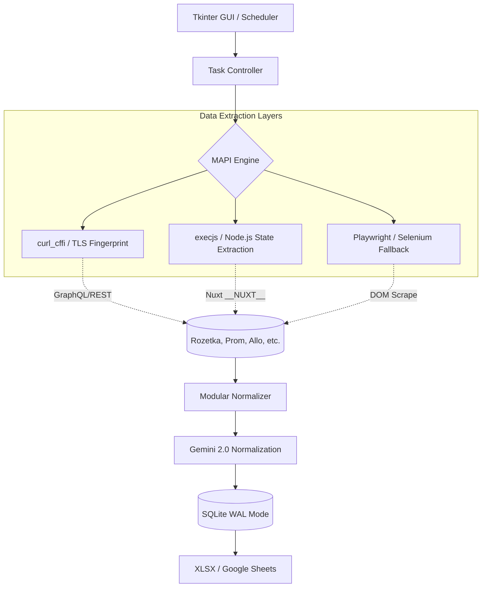

# Marketplace Intelligence Tool

**An industrial-grade competitive intelligence engine that transforms fragmented Ukrainian e-commerce data into actionable business structured insights.**

---

## 💼 Business & Product Context
In the highly competitive Ukrainian e-commerce landscape (dominated by Rozetka, Prom, and Allo), price agility and assortment depth define market share. For B2B sellers, manually tracking thousands of SKUs across multiple platforms is a bottleneck.

This tool solves the **fragmented data problem** by:
- **Consolidating Multi-Channel Data:** Aggregating pricing, availability, and specs from 6+ major marketplaces.
- **Enabling Price Intelligence:** Moving from "guessing" to data-driven pricing through automated snapshots and monitoring.
- **Structured Normalization:** Converting messy, site-specific HTML/JSON into a unified schema for LLM-powered audits and reporting.

---

## 🏗️ Architecture Overview

The system is built on a modular "MAPI" (Marketplace API) engine, designed to handle the heterogeneity of web architectures—ranging from legacy PHP stores to modern Nuxt.js SSR applications.

---

## 🛠️ Technical Deep Dive: Why It’s Hard

Building a scraper is easy; building a **resilient scraping pipeline** that survives production anti-bot measures is an engineering challenge.

### 1. The Cat-and-Mouse Game (TLS & Fingerprinting)
Modern marketplaces use sophisticated WAFs (Cloudflare/Akamai) that detect standard Python `requests` or `httpx` via TLS fingerprinting.
- **Solution:** Integrated `curl_cffi` to impersonate browser-level TLS fingerprints (JA3/JA3S). This allows for high-speed HEAD and GET requests without the overhead of a headless browser.

### 2. State Extraction vs. DOM Scraping
Many modern targets (like those built on Nuxt.js) bake their data into an internal JavaScript state object. Scraping the DOM is fragile and slow.
- **Solution:** Implemented `execjs` with a Node.js runtime to execute site-specific logic and extract the raw `__NUXT__` or `__INITIAL_STATE__` objects. This provides 100% data fidelity compared to regex-based HTML parsing.

### 3. Asynchronous Efficiency & SQLite Concurrency
Handling thousands of concurrent requests while maintaining a local database requires careful state management.
- **Solution:** Utilized **SQLite in WAL (Write-Ahead Logging) mode** with thread-local connections. This enables high-concurrency read/write operations, preventing database locks during intensive scraping runs while maintaining a lightweight footprint compared to PostgreSQL.

### 4. The Fallback Chain
Websites change. A rigid scraper is a broken scraper.
- **Implementation:** A tiered extraction strategy:
    1. **MAPI (Preferred):** Direct REST/GraphQL/AJAX intercepts.
    2. **SSR State:** Extraction of JSON blobs from HTML metadata.
    3. **Playwright/Selenium:** Full browser rendering for JS-heavy or CAPTCHA-gated pages.

---

## ⚡ Key Technical Decisions

| Feature | Implementation | Rationale |
| :--- | :--- | :--- |
| **Concurrency** | `asyncio` + `TaskScheduler` | High throughput for I/O bound network requests. |
| **Normalization** | Gemini 2.0 Flash Agent | Uses LLM to resolve attribute discrepancies (e.g., "Weight" vs "Mass") into a canonical schema. |
| **GUI** | Threaded Tkinter | Provides a responsive dashboard for non-technical users without blocking the scraping loop. |
| **Persistence** | SQLite (WAL) | Zero-config, ACID compliant, and optimized for localized data snapshots. |

---

## 🚀 Roadmap & Current Status

- [x] **Core Engine:** Completed MAPI architecture for Rozetka, Prom, and Allo.
- [x] **Anti-Bot:** Integrated TLS impersonation and proxy rotation.
- [x] **AI Layer:** Gemini-powered attribute normalization and title cleaning.
- [ ] **Phase 2:** Implement Differential Sync (scrape only changed prices to save bandwidth).
- [ ] **Phase 3:** Web Dashboard (Transitioning from Tkinter to a Next.js frontend).
- [ ] **Phase 4:** Automated PDF "Market Health" report generation.

---

**Built with precision for the Ukrainian e-commerce market.**  
*This is a solo-engineered project focusing on high-load data extraction and product-market fit.*
